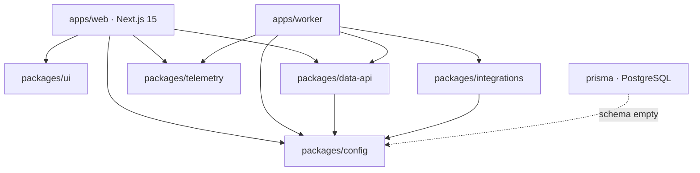

# BNB Agent Studio Marketplace

The operating system for AI agents on BNB Chain: discover, compare, hire,
permission, and monitor AI agents across rebalancing, grid trading, yield
optimization, and health-factor monitoring.

> **Status: live foundation.** Marketplace UI (discovery, agent details,
> compare, leaderboards, categories) is implemented, plus read-only integration
> layers: 8004scan registry identity (keyless-safe), ALTANA wallet/x402/ERC-8183
> adapters (execution gated on external credentials), TermiX AACP read-only
> reputation, and PancakeSwap read-only pool intelligence. Live registry data
> and any payment/execution flows require external keys/credentials (see
> `docs/`). The database schema remains intentionally empty.

---

## Overview

- **Web app:** Next.js 15 (App Router) + React 19 + Tailwind CSS
- **Monorepo:** Turborepo + pnpm workspaces
- **Client state:** TanStack Query (server cache) + Zustand (UI state)
- **Data layer:** Prisma + PostgreSQL (schema intentionally empty for now)
- **Backend processes:** standalone `worker` app (placeholder)
- **Integrations:** 8004scan (server-only, keyless-safe), ALTANA
  (wallet/x402/ERC-8183 to honest boundaries), TermiX AACP (read-only
  reputation), PancakeSwap (read-only pool intelligence), BNB Agent Studio
  (placeholder)
- **Quality:** ESLint 9, Prettier, Husky, lint-staged, GitHub Actions CI
- **Runtime:** Docker + Docker Compose (Postgres + Redis for local dev)

## Architecture



The monorepo is layered so that **all marketplace business logic lives in
`packages/`** and is consumed by thin `apps/`. Providers (ALTANA, TERMIX,
PancakeSwap, Agent Studio) are behind adapter interfaces in
`packages/integrations`, so implementations can be swapped without touching
consumers.

## Folder Structure

```
bnb-agent-marketplace/
├─ apps/
│  ├─ web/                    # Next.js 15 marketplace (App Router)
│  │  └─ app/
│  │     ├─ (app)/            # app-shell route group (nav/sidebar/footer)
│  │     │  ├─ dashboard/
│  │     │  ├─ marketplace/
│  │     │  ├─ agents/[slug]/
│  │     │  ├─ categories/{rebalancing,grid-trading,yield,health-factor}/
│  │     │  ├─ compare/
│  │     │  ├─ leaderboards/
│  │     │  ├─ settings/
│  │     │  ├─ profile/
│  │     │  └─ login/
│  │     ├─ layout.tsx page.tsx loading.tsx error.tsx not-found.tsx
│  │     └─ globals.css       # design tokens (Tailwind HSL vars)
│  └─ worker/                 # background workloads (placeholder)
├─ packages/
│  ├─ ui/                     # design-system components (shadcn-style)
│  ├─ config/                 # env validation, constants, feature flags, types
│  ├─ telemetry/              # logger, OTel placeholder, performance monitor
│  ├─ data-api/               # typed HTTP client, envelope, error handling
│  └─ integrations/           # adapter implementations + verify harnesses
│     ├─ altana/  termix/  pancakeswap/  studio/
├─ prisma/                    # Prisma init (PostgreSQL, no models yet)
├─ docs/                      # architecture & PRD
├─ tests/                     # future test suites
├─ .github/workflows/ci.yml   # install / lint / typecheck / build / format
└─ (Dockerfile, docker-compose.yml, eslint, prettier, husky…)
```

## Prerequisites

| Tool    | Version    | Notes                                |
| ------- | ---------- | ------------------------------------ |
| Node.js | >= 20      | 24.x verified                        |
| pnpm    | 9.15.9     | `npm i -g pnpm@9.15.9` if missing    |
| Docker  | any recent | only needed for local Postgres/Redis |

## Getting Started

```bash
# 1. Install dependencies
pnpm install

# 2. Start infrastructure (Postgres + Redis)
docker compose up -d

# 3. Generate the Prisma client
pnpm prisma:generate

# 4. Start the web app in dev mode
pnpm dev
# → web: http://localhost:3000
```

> The worker app also runs via `pnpm --filter @bnb-marketplace/worker dev`.
> No `.env` file is required for the scaffold; see
> `packages/config/src/env.ts` for the defaults it validates.

## Environment

Copy the example environment file to a local (gitignored) env file:

```bash
cp .env.example .env.local
```

No variables are required to run the scaffold. For live ERC-8004
registry data on the Leaderboards page, add your 8004scan API key:

```env
8004SCAN_API_KEY=
```

The key is read **server-side only** and is never shipped to the browser.
Without a key, the `/leaderboards` route renders an honest
registry-pending state instead of fabricating data.

## Development Commands

| Command                | Purpose                                   |
| ---------------------- | ----------------------------------------- |
| `pnpm dev`             | Run all apps in watch mode (Turborepo)    |
| `pnpm build`           | Build all workspace packages + apps       |
| `pnpm lint`            | ESLint across the monorepo                |
| `pnpm typecheck`       | TypeScript type-check across the monorepo |
| `pnpm format`          | Prettier write across the monorepo        |
| `pnpm format:check`    | Prettier check (used in CI)               |
| `pnpm check`           | lint + typecheck + build in one shot      |
| `pnpm prisma:generate` | Generate Prisma client                    |
| `pnpm prisma:migrate`  | Run `prisma migrate dev` (no models yet)  |
| `pnpm clean`           | Remove build artifacts + node_modules     |

### Scoped commands

```bash
pnpm --filter @bnb-marketplace/web dev
pnpm --filter @bnb-marketplace/ui build
pnpm --filter @bnb-marketplace/worker dev
```

## Docker

- `docker compose up -d` — starts **PostgreSQL 16** and **Redis 7** for local
  development.
- `docker build -t bnbsm-web .` — builds the Next.js app image (standalone
  output, non-root user).
- Docker is **not required** for building or running the code; only for the
  local datastores.

## CI/CD

`.github/workflows/ci.yml` runs on push to `main` and on PRs:

1. **install** — pnpm frozen-lockfile install
2. **lint** — `pnpm lint`
3. **typecheck** — `pnpm typecheck` (with `prisma generate` first)
4. **build** — `pnpm build`
5. **format** — `pnpm format:check`

## Code Quality

- **ESLint 9** flat config (`eslint.config.mjs`) with `typescript-eslint`
  recommended rules.
- **Prettier** with `.prettierrc` / `.prettierignore`.
- **Husky + lint-staged** run on `pre-commit` (ESLint `--fix` + Prettier on
  staged files).
- **EditorConfig** enforces consistent indentation and line endings.

## Design System

`packages/ui` ships reusable, unstyled-by-page primitives (Button, Card, Input,
Badge, Avatar, Tabs, Modal, Table, Dropdown, Pagination, Skeleton, Alert,
EmptyState, LoadingSpinner) built on Radix UI + class-variance-authority +
tailwind-merge. Design tokens (BNB-gold accent, dark-first palette, semantic
status colors) live in `apps/web/app/globals.css`.

## Roadmap

1. **Phase 0 — Foundation** _(this repo)_
2. **Phase 1 — Catalog & Discovery**: search, facets, compare, category
   dashboards, leaderboards, SEO.
3. **Phase 2 — Auth & Wallet**: wallet connect, ALTANA session keys (spend
   caps, expiry, revocation).
4. **Phase 3 — Hiring & Monitoring**: hire flow, live dashboards, alerts.
5. **Phase 4 — Partners**: TERMIX advantage reports, PancakeSwap LP/yield
   ranking.
6. **Phase 5 — Polish**: a11y, perf gates, E2E, demo seeds.

See `docs/` for the full PRD and architecture decisions.

## License

Proprietary. All rights reserved. See `LICENSE`.
