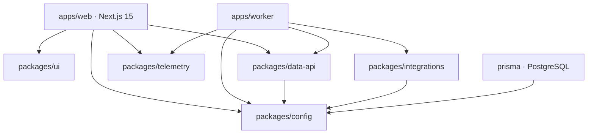

# BNB Agent Studio Marketplace

A production marketplace for discovering, understanding, comparing, and safely activating AI agents on BNB Chain.

Discover agents by category, inspect source-attributed data, compare candidates side by side, and review activation requirements without fabricated execution claims.

**Live:** https://bnb-agent-marketplace-web.vercel.app

**Production release:** `feca55c` — Vercel deployment `1de9e76f66ae` (Ready). Current repository HEAD: `8b7fcff` (docs-only submission audit updates ahead of the production app commit).

Status: Live production release. The marketplace is production-deployed and provides discovery, agent details, comparison, category navigation, trust/provenance information, dashboard funded-hire visibility, and an honest activation boundary that distinguishes Model A from Model B.

---

## Four First-Class Agent Categories

### Rebalancing

Manages LP ranges and resets positions automatically.

### Grid Trading

Places and manages automated grid orders.

### Yield Optimisation

Routes liquidity toward available yield opportunities.

### Health Factor Monitoring

Helps protect lending positions from liquidation risk.

Each category has a dedicated dashboard, leaderboards, and discovery. Agents are surfaced by category through real registry data and BSC discovery without claiming execution where authoritative evidence is unavailable.

## Marketplace Experience

### Discover

Browse agents across all four required categories with search, facets, and category dashboards.

### Understand

Inspect agent identity, source attribution, available evidence, and relevant marketplace information on dedicated agent pages.

### Compare

Compare agents side by side with explicit unavailable/pending states instead of fabricated metrics.

### Review Activation

Review whether an agent is currently eligible for activation. For **Main Track Model B commercial Hire** the flow is **implemented and live**: the marketplace dynamically negotiates with real discovered ERC-8183 sellers (e.g. **Agent 2005 — Canned Range Keeper**), verifies the provider signature, and builds a browser-wallet Hire plan from the real quote. **A real Model-B commercial hire was successfully funded as Job 787 on BSC Testnet for 0.001 U (chain 97, provider = registered owner of Agent 2005 / Canned Range Keeper). It is visible as FUNDED in the dashboard and is deliberately not represented as ACTIVE.** The earlier X.157 headless/browser execution attempt was blocked at its first broadcast by the documented RPC infrastructure issue and remained fail-closed — Job 787 is the separately verified funded commercial-hire evidence.

## Trust & Data Quality

The marketplace does not fabricate:

- price
- APY
- TVL
- volume
- risk
- performance
- execution status
- funded jobs
- sessions
- transactions
- execution capabilities

When authoritative data is unavailable, the UI explicitly shows pending/unavailable states.

- Identity provenance via 8004scan / ERC-8004 where available (server-side, keyless-safe, `8004SCAN_API_KEY` / `E8004SCAN_API_KEY` never exposed to the browser).
- Server-side integration boundaries for all external providers.
- Fail-closed activation: no agent is shown as ACTIVE without authoritative evidence.
- Source attribution on every data surface (registry, market intelligence, reputation).

Registry data is surfaced when credentials/configuration are available; otherwise honest pending/offline states are shown — no values are invented.

## Activation & Safety

**Model A activation remains fail-closed** pending authoritative execution-capability and custody prerequisites. The marketplace does not represent an agent as ACTIVE unless the required authoritative execution and authorization evidence exists.

**Main Track Model B commercial Hire is live** and uses the user's EIP-1193 browser wallet. It negotiates a live quote, verifies the provider signature, and executes the ERC-8183 sequence via the user's wallet with receipt and independent on-chain verification, resulting in a FUNDED commercial-hire state that is intentionally distinct from ACTIVE.

The marketplace therefore does NOT simulate:

- ACTIVE sessions
- funded ERC-8183 jobs
- provider execution capability
- transactions
- execution results

This is a deliberate trust boundary, not a simulated demo state.

## BNB Agent Studio / ERC-8183

The marketplace includes ERC-8004 / ERC-8183 / BNB Agent Studio integration: real registry discovery (8004scan), on-chain agent identity + endpoints, live seller negotiation, provider-signature verification (official SDK), and a browser-wallet ERC-8183 commercial hire path.

**Live discovered seller example — Agent 2005 — Canned Range Keeper (BSC Testnet, chain 97)** is a live registry-discovered ERC-8183 seller. Its registered endpoint `https://range-keeper.103-195-188-198.sslip.io/erc8183` is reachable and resolves from the on-chain Agent Card; `POST /negotiate` returns a fresh quote whose `provider_sig` verifies with the official SDK against the registered owner. The observed quote was **0.001 U** at verification time (official chain-97 commerce + $U, future expiry). The marketplace Hire UI surfaces the real quote (provider, price, expiry, network). Agent 1906 is not claimed as a live seller because its endpoint is currently unavailable.

**Real funded Hire evidence:** A real Model-B commercial hire was successfully funded as **Job 787** on BSC Testnet for **0.001 U** (chain 97, provider = registered owner of Agent 2005 / Canned Range Keeper). It is visible as **FUNDED** in the dashboard and is deliberately not represented as ACTIVE. The earlier X.157 attempt was blocked at its first broadcast by the documented RPC infrastructure issue and remained fail-closed — Job 787 is the separately verified funded evidence.

### Main Track Hire (Model B — browser-wallet commercial hire)

The Main Track Hire path (`model-b-v2-commercial-agreement`) is a real, deployed ERC-8183 commercial hire flow:

- USER → Marketplace → **live discovered seller** (e.g. Agent 2005) → live `/negotiate` quote → official provider-signature verification → explicit confirmation → user's EIP-1193 wallet → ERC-8183 sequence (`createJob` → `registerJob` → `setBudget` → `approve` → `fund`) → marketplace-owned receipt verification → independent on-chain verification → `funded-commercial-hire`.
- The browser wallet owns nonce, gas, signing and submission (`eth_sendTransaction`); the marketplace never receives a private key, never signs, and never calls `eth_sendRawTransaction` for user transactions.
- FUNDED is commercial escrow — it is never shown as ACTIVE/RUNNING/EXECUTING/COMPLETED.
- Every transaction target is checked against the pinned chain-97 ERC-8183 addresses (policy `0xd6a42175…`); historical job IDs are never reused; the provider, price, expiry and terms come from the live quote (never hardcoded).
- The server route (`/api/activation/main-track-hire`) exposes `prepare` / `receipt` / `verify` as read-only; the user's browser wallet is the only signer/broadcaster.
- The five blockchain calls are separate contract state changes and are intentionally wallet-authorized, not a single transaction. The marketplace never possesses the user's private key.

### Real funded Hire evidence

Job 787 is a real BSC Testnet ERC-8183 commercial hire.

- State: **FUNDED**
- Budget: **0.001 U**
- Chain: BSC Testnet (97)
- Client: hiring wallet
- Provider: registered owner of Agent 2005
- Agent: Canned Range Keeper
- Dashboard: **FUNDED**
- ACTIVE: not claimed

FUNDED represents commercial escrow funded for the ERC-8183 job. It does not mean the agent has reached an authoritative ACTIVE execution state.

### Dashboard

Your hired agents distinguishes commercial FUNDED hires from authoritatively ACTIVE agents.

- **FUNDED** = commercial escrow funded.
- **ACTIVE** = authoritative execution state.

For the verified Job 787 evidence, the dashboard shows:

- Funded hires: 1
- Active agents: 0

This is intentional and avoids fabricating an ACTIVE execution state.

## PancakeSwap Market Intelligence

**PancakeSwap status: PARTIAL — read-only market intelligence.**

The marketplace includes real BSC mainnet PancakeSwap V2 read-only market intelligence.

It uses on-chain reserve data and official pricing information to derive market intelligence such as pool TVL.

- Chain: BSC mainnet / Chain ID 56
- Read-only
- No wallet signing
- No swaps
- No liquidity transactions
- APR/APY are not fabricated
- Unavailable volume is shown as unavailable

No automated trading or LP management is claimed.

## TermiX Evidence

**TermiX status: PARTIAL.**

The repository includes an Agent Advantage experiment covering three real A/B tasks, including a security task.

The experiment measures marketplace discovery/intelligence against a baseline.

It does NOT claim that those tasks were completed through a real paid marketplace hire. Production marketplace Hire remains fail-closed. The existing report is evidence of discovery capability, not proof of completed marketplace hiring. The report is `docs/termix/Agent-Advantage-Report.md` with evidence under `docs/termix/evidence/`.

## Altana

**Altana status: NOT QUALIFIED for the core session-key requirement.**

Existing Altana integration evidence exists (wallet/session scaffolding and capability adapters), but the production Hire is the Model-B browser-wallet ERC-8183 path, not an integrated Altana session-key path. A normal browser-wallet ERC-8183 Hire is **not** an Altana session-key transaction.

## Security

Verified production protections:

- CSP with nonce / `strict-dynamic`
- HSTS (`max-age=63072000; includeSubDomains`)
- `X-Content-Type-Options: nosniff`
- Frame denial (`X-Frame-Options: DENY`, `frame-ancestors 'none'`)
- `Referrer-Policy: strict-origin-when-cross-origin`
- `Permissions-Policy` (camera, geolocation, microphone, payment, usb disabled)
- Server-side credential handling (no `NEXT_PUBLIC_` secrets)
- Fail-closed activation (no bypass, no fabricated sessions)

## Architecture

The monorepo separates the Next.js application from reusable workspace packages and integration adapters.

- `apps/web` — Next.js 15 marketplace (App Router)
- `packages/ui` — design-system components
- `packages/config` — env validation, constants, feature flags, types
- `packages/data-api` — typed HTTP client, envelope, error handling
- `packages/integrations` — adapter implementations (altana, termix, pancakeswap, studio)
- `prisma` — PostgreSQL schema and generated client
- `docs` — architecture, PRD, and review evidence



## Folder Structure

```
bnb-agent-marketplace/
├─ apps/
│  ├─ web/                    # Next.js 15 marketplace (App Router)
│  │  └─ app/
│  │     ├─ (app)/            # app-shell route group (nav/sidebar/footer)
│  │     │  ├─ dashboard/
│  │     │  ├─ marketplace/
│  │     │  ├─ agents/[slug]/
│  │     │  ├─ categories/{rebalancing,grid-trading,yield,health-factor}/
│  │     │  ├─ compare/
│  │     │  ├─ leaderboards/
│  │     │  ├─ settings/
│  │     │  ├─ profile/
│  │     │  └─ login/
│  │     ├─ layout.tsx page.tsx loading.tsx error.tsx not-found.tsx
│  │     └─ globals.css       # design tokens (Tailwind HSL vars)
│  └─ worker/                 # background workloads
├─ packages/
│  ├─ ui/                     # design-system components
│  ├─ config/                 # env validation, constants, feature flags, types
│  ├─ telemetry/              # logger, OTel placeholder, performance monitor
│  ├─ data-api/               # typed HTTP client, envelope, error handling
│  └─ integrations/           # adapter implementations + verify harnesses
│     ├─ altana/  termix/  pancakeswap/  studio/
├─ prisma/                    # Prisma schema (PostgreSQL)
├─ docs/                      # architecture, PRD, review evidence
├─ tests/                     # test suites
├─ .github/workflows/ci.yml   # install / lint / typecheck / build / format
└─ (Dockerfile, docker-compose.yml, eslint, prettier, husky…)
```

## Prerequisites

| Tool    | Version    | Notes                                |
| ------- | ---------- | ------------------------------------ |
| Node.js | >= 20      | 24.x verified                        |
| pnpm    | 9.15.9     | `npm i -g pnpm@9.15.9` if missing    |
| Docker  | any recent | only needed for local Postgres/Redis |

## Getting Started

```bash
# 1. Install dependencies
pnpm install

# 2. Start infrastructure (Postgres + Redis)
docker compose up -d

# 3. Generate the Prisma client
pnpm prisma:generate

# 4. Start the web app in dev mode
pnpm dev
# → web: http://localhost:3000
```

> The worker app also runs via `pnpm --filter @bnb-marketplace/worker dev`.
> No `.env` file is required; see `packages/config/src/env.ts` for defaults.

## Environment

Copy the example environment file to a local (gitignored) env file:

```bash
cp .env.example .env.local
```

No variables are required to run the scaffold. For live ERC-8004 registry data, add your 8004scan API key:

```env
8004SCAN_API_KEY=
```

The key is read **server-side only** and is never shipped to the browser. Without a key, registry-dependent surfaces render honest pending/offline states.

## Development Commands

| Command                | Purpose                                   |
| ---------------------- | ----------------------------------------- |
| `pnpm dev`             | Run all apps in watch mode (Turborepo)    |
| `pnpm build`           | Build all workspace packages + apps       |
| `pnpm lint`            | ESLint across the monorepo                |
| `pnpm typecheck`       | TypeScript type-check across the monorepo |
| `pnpm format`          | Prettier write across the monorepo        |
| `pnpm format:check`    | Prettier check (used in CI)               |
| `pnpm check`           | lint + typecheck + build in one shot      |
| `pnpm prisma:generate` | Generate Prisma client                    |
| `pnpm prisma:migrate`  | Run `prisma migrate dev`                  |
| `pnpm clean`           | Remove build artifacts + node_modules     |

### Scoped commands

```bash
pnpm --filter @bnb-marketplace/web dev
pnpm --filter @bnb-marketplace/ui build
pnpm --filter @bnb-marketplace/worker dev
```

## Docker

- `docker compose up -d` — starts **PostgreSQL 16** and **Redis 7** for local development.
- `docker build -t bnbsm-web .` — builds the Next.js app image (standalone output, non-root user).
- Docker is **not required** for building or running the code; only for the local datastores.

## CI/CD

`.github/workflows/ci.yml` runs on push to `main` and on PRs:

1. **install** — pnpm frozen-lockfile install
2. **lint** — `pnpm lint`
3. **typecheck** — `pnpm typecheck` (with `prisma generate` first)
4. **build** — `pnpm build`
5. **format** — `pnpm format:check`

## Current Product Status

### Production

Live on Vercel.

### Discovery

Complete.

### Agent Details

Complete.

### Comparison

Complete.

### Four Category Experience

Complete.

### Trust / Data Provenance

Complete.

### PancakeSwap Intelligence

Read-only production capability.

### TermiX Evidence

Evidence package available with explicit limitations.

### Real Activation (Model A)

Fail-closed pending authoritative execution-capability and custody prerequisites. Model A remains fail-closed by design.

### Main Track Hire (Model B)

Live and deployed. A real Model-B commercial hire was successfully funded as **Job 787** on BSC Testnet for **0.001 U** (chain 97, provider = registered owner of Agent 2005). It appears as **FUNDED** in the dashboard, not ACTIVE. The earlier X.157 attempt was blocked at the first broadcast by a documented RPC issue and remains fail-closed — Job 787 is the verified funded evidence.

## Release

**Production release:** `feca55c` — Vercel deployment `1de9e76f66ae` (Ready)

Current repository HEAD: `8b7fcff` (docs-only submission audit updates ahead of the production app commit — app code identical).

Live:

https://bnb-agent-marketplace-web.vercel.app

## Recommended Judge Flow

1. Open the production marketplace at https://bnb-agent-marketplace-web.vercel.app
2. Browse the four first-class categories (Rebalancing, Grid Trading, Yield Optimisation, Health Factor Monitoring).
3. Search for **"Canned Range Keeper"** or **"Agent 2005"**.
4. Open the Agent 2005 detail page (chain 97).
5. Inspect its registry identity and registered ERC-8183 endpoint.
6. Open **Hire**.
7. Review the dynamically negotiated quote (live provider, observed 0.001 U at verification, expiry, chain 97, official commerce + $U).
8. Review provider, price, expiry, chain and payment token.
9. Observe that the user wallet controls signing and broadcast (`eth_sendTransaction`, no server custody).
10. Open **Dashboard → Your hired agents**.
11. Observe **Job 787** represented as **FUNDED** (0.001 U, BSC Testnet) — deliberately distinct from ACTIVE.
12. Note that FUNDED is commercial escrow and does not imply ACTIVE execution.

Do not execute another Hire merely to reproduce Job 787. The existing Job 787 is the verified on-chain evidence.

## Testing

- `pnpm --filter @bnb-marketplace/web typecheck` / `lint` / `build`
- `pnpm --filter @bnb-marketplace/integrations typecheck` / `lint` / `build`
- Main Track Hire harness: `pnpm --dir apps/web run activation:main-track-user-hire:verify`
- Main Track wiring: `pnpm --dir apps/web run activation:main-track:verify`
- Security: `pnpm --dir apps/web run security:x49:verify`
- Discovery: `pnpm --dir apps/web run marketplace:verify` and `discovery:verify`
- ERC-8183: `pnpm --dir packages/integrations exec node dist/altana/erc8183.verify.js`
- These are all read-only/no-transaction harnesses.

## License

Proprietary. All rights reserved. See `LICENSE`.
