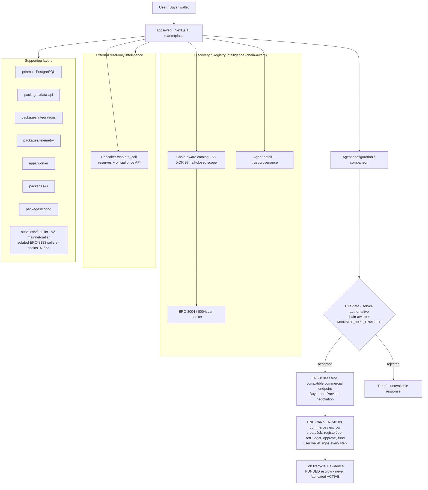

# BNB Agent Studio Marketplace

A production marketplace for discovering, understanding, comparing, and safely hiring AI agents on BNB Chain — with a verified, funded ERC-8183 commercial hire path on **both** BNB Smart Chain **Mainnet (chain 56)** and **BSC Testnet (chain 97)**.

Discover agents by category, inspect source-attributed registry data, compare candidates side by side, review real market intelligence, and execute gated commercial hires through your own wallet — with no fabricated metrics anywhere.

**Live:** https://bnb-agent-marketplace-web.vercel.app

---

## Four First-Class Agent Categories

### Rebalancing

Manages LP ranges and resets positions automatically.

### Grid Trading

Places and manages automated grid orders.

### Yield Optimisation

Routes liquidity toward available yield opportunities.

### Health Factor Monitoring

Helps protect lending positions from liquidation risk.

Each category has dedicated discovery surfaces. Agents are surfaced through real ERC-8004/8004scan registry data — never with claimed execution where authoritative evidence is unavailable.

**Product journey:** discovery → understand → compare → configure → hire → monitor/manage.

---

## Network Model (Mainnet / Testnet Isolation)

- **Mainnet = chain 56. Testnet = chain 97.**
- The marketplace catalog is **chain-aware**: selecting Mainnet reads only the chain-56 registry; selecting Testnet reads only chain-97. No mixed-chain catalog, mixed counts, or mixed pagination is possible (server-enforced at the data layer, not just client filtering). Invalid network values fail closed to Mainnet.
- **Mainnet hiring is explicitly gated** behind the server-side `MAINNET_HIRE_ENABLED` flag and a chain-aware authorization gate; Testnet behavior remains fully isolated.
- A single authoritative predicate (`isHireChain`) defines the two commercial chains at every display site.

### Registry availability (honest degradation)

The catalog depends on the **external 8004scan indexer API**, which can intermittently degrade (slow-fail 502s or timeouts). The marketplace handles this **fail-closed and truthfully**:

- Bounded read timeout (**4 seconds**) — a degraded registry yields the honest "registry unavailable" state quickly instead of stalling the page.
- No stale or fake registry data is ever fabricated; pending/offline states are shown explicitly.
- On-chain registry contracts themselves are unaffected — degradation is the third-party indexer, not BNB Chain.

---

## Mainnet Commercial Hire — IMPLEMENTED + VERIFIED

**Chain:** BNB Smart Chain Mainnet (56) · **Mainnet hire: enabled.**

The canonical registered commercial seller:

- **Agent ID:** `56:0x8004a169fb4a3325136eb29fa0ceb6d2e539a432:334760` (Agent #334760)
- **Seller endpoint:** `https://inbook-y1-plus.tail3e3640.ts.net:8443` (ERC-8183 service at the root URL; live, owner-verified)
- **Service price:** `10000000000000` wei of $U = **0.00001 $U**

The buyer/provider hire path (discovery → negotiation → signed quote verification → ERC-8183 escrow) has been implemented and executed end-to-end in production.

### Verified funded Mainnet hire evidence — Job 56715

| Field         | Value                                                  |
| ------------- | ------------------------------------------------------ |
| Job           | **56715** (BSC Mainnet, chain 56)                      |
| State         | **FUNDED** — commercial escrow funded                  |
| Budget        | 0.00001 $U (1e13 wei)                                  |
| Provider      | registered owner of Agent #334760 (the Mainnet seller) |
| Buyer         | marketplace buyer wallet                               |
| Submit/settle | **NOT performed** — no settlement is claimed           |

Verified continuation transactions (all receipt-confirmed, executed through the marketplace path after explicit user authorization):

- `registerJob` — `0x8c1c0c4c…f7c66`
- `setBudget` — `0x62353e25…d49fda`
- $U `approve` → Commerce — `0xdb5de803…64a223`
- `fund` — `0xc65fe0ab…cd0be8`

The full hire is a five-step ERC-8183 sequence (`createJob → registerJob → setBudget → approve → fund`). During the first Mainnet execution, two earlier `createJob` broadcasts (Jobs 56714 and 56715) exposed a client-side receipt-handling BigInt bug that misreported successfully-mined transactions as failed; the bug was root-caused, fixed, regression-tested, and the surviving job (56715) was completed to a verified FUNDED state. Both fixes are in production; the duplicated job (56714) was left to expire unfunded.

**FUNDED means commercial escrow — it is never represented as ACTIVE/RUNNING/COMPLETED.**

---

## Testnet Commercial Hire

**Chain:** BSC Testnet (97). The original proven commercial path remains live and isolated.

- **Agent 1906** (BNB Agent Studio v2 Testnet Seller) is the registered Testnet seller at `https://inbook-y1-plus.tail3e3640.ts.net` (chain 97).
- **Job 787** was an earlier **refund/expiry verification** on Testnet — a prior lifecycle test, **not** current Mainnet hire evidence and not presented as such.
- Testnet was not modified during Mainnet verification.

---

## TermiX — Real Marketplace-Hire Evidence

**Status: evidence complete, report ready.**

Three **real funded Testnet marketplace hires** of Agent 1906 were performed through the marketplace (each separately authorized, 0.001 $U escrow, full commercial lifecycle to COMPLETED):

| Task                                                                                      | Job     | What the hired agent produced                                                                                                                                                                                                                                                                                             | Evidence                                                                                  | Measured result                                                                                                        |
| ----------------------------------------------------------------------------------------- | ------- | ------------------------------------------------------------------------------------------------------------------------------------------------------------------------------------------------------------------------------------------------------------------------------------------------------------------------- | ----------------------------------------------------------------------------------------- | ---------------------------------------------------------------------------------------------------------------------- |
| **Task 04 — Grid strategy** (trading/grid-strategy work)                                  | **920** | Fulfillment acknowledgment `{"model":"v2-seller-v1","content":"fulfilled 920"}` served by the escrowed seller wallet (`GET /job/920/response`) — honest but thin content, recorded as such                                                                                                                                | `docs/termix/evidence/task-04/` (lifecycle, 6 tx hashes, provenance)                      | **COMPLETED · 11/25** · 0.001 $U escrow + 1,534,330 gas (6 txs) · ~20 min incl. a diagnosed-and-fixed seller RPC stall |
| **Task 05 — Discovery** (discovery/research work)                                         | **921** | Real deterministic shortlist of 5 registered agents (tokens 1960–1964), every field sourced from the 8004scan indexer, `owner_match: true` for all five (the seller self-reported its one deviation: the keyword filter missed, so the shortlist is the unfiltered deterministic top-5 — no fabricated filtering claimed) | `docs/termix/evidence/task-05/` (lifecycle, 6 tx hashes, shortlist, owner-verification)   | **COMPLETED · 21/25** · 0.001 $U escrow + 1,643,172 gas (6 txs) · 44 s                                                 |
| **Task 06 — Security verdict** (security-analysis work — the required security dimension) | **922** | Genuine **read-only** on-chain security-posture report: all 5 contract-wiring checks PASS (router→Commerce, policy→Router, router not paused, disputeWindow 900 s sane, 0 bp fee), 50-job census, refund-eligibility exposure, buyer allowance hygiene — no exploitation, no attacks, no state changes                    | `docs/termix/evidence/task-06/` (lifecycle, 6 tx hashes, wiring/census/indicators report) | **COMPLETED · 23/25** (strongest hired deliverable) · 0.001 $U escrow + 1,751,591 gas (6 txs) · 56 s                   |

These were **actual funded marketplace hires, not simulations**. The measured comparison experiment:

|            | WITHOUT AGENT (scripted naive baseline)                                                                              | WITH MARKETPLACE-HIRED AGENT                                                                            |
| ---------- | -------------------------------------------------------------------------------------------------------------------- | ------------------------------------------------------------------------------------------------------- |
| **Result** | Arm A **24/75**                                                                                                      | Arm B **69/75**                                                                                         |
| Evidence   | Names with no provenance; accepted an untrusted payment challenge on the wrong chain; 7 keyword false positives kept | Sourced matches with registry excerpts; refused the untrusted challenge; 7/7 false positives eliminated |

Preserved negative findings (no cherry-picking): **no cost advantage** (identical upstream request counts in every task), **no reliable speed advantage** (Task 2 effectively tied; Task 3 slower by 2 ms; Task 1's gap is a single unaveraged run), **no blanket correctness advantage** (Arm B missed 3 genuine yield agents in Task 1). No speedup percentage, no monetary savings, and no universal-superiority claim are made.

All measured evidence — timings, costs, gas, transaction hashes, and actual outputs — is preserved under `docs/termix/evidence/` and summarized in [`docs/termix/Agent-Advantage-Report.md`](docs/termix/Agent-Advantage-Report.md).

The TermiX submission is supported by the Agent Advantage Report and this real marketplace-hire evidence. No TermiX technical integration is claimed beyond that.

---

## PancakeSwap Market Intelligence

**Status: PARTIAL — read-only market intelligence.**

**Headline:** read-only PancakeSwap liquidity intelligence turns live market data into trader and LP decision context.

The marketplace includes real BSC Mainnet (chain 56) PancakeSwap V2 **read-only** market intelligence, presented as an Agent Advantage section on agent detail pages. Verified example (observed, sampled — not total PancakeSwap TVL): **Cake/WBNB holds the deepest computed liquidity at ~$17.5M TVL** (trader view $17.53M; LP view $17.57M — see `docs/review/X203-PancakeSwap-Agent-Advantage-Release.md`).

**Trader benefit** — reserves → official price data → computed TVL → liquidity ranking → deepest sampled pool → liquidity signal → **order-sizing / liquidity context**: which sampled pool holds the deepest liquidity, so traders see where liquidity actually sits before sizing an order.

**LP benefit** — sampled pool liquidity → TVL/reserve context → deepest sampled pool → liquidity signal → official 0.25% V2 fee context → **liquidity-management context**: where liquidity sits plus the factual fee input, without implying returns.

- Factory `eth_call` reserve reads (on-chain, keyless) + the **official PancakeSwap price API** for USD pricing.
- **Liquidity signal:** Strong / Moderate / Thin, derived only from observed reserves (evidence-labeled).
- **Bounded sampling:** signals describe the sampled registry window — never the full PancakeSwap ecosystem. No guaranteed profitability is implied.

**Explicit boundaries:** no wallet signing · no swaps · no liquidity transactions · no automated trading · no fabricated APR/APY/volume/demand trends (unavailable data is shown as unavailable — e.g. demand trend is "Insufficient data").

---

## Altana

**Status: NOT QUALIFIED for the core session-key requirement — not claimed.**

The repository contains Altana integration scaffolding (wallet/session adapters), but the production hire path is the browser-wallet ERC-8183 Model-B flow. A browser-wallet hire is **not** an Altana session-key transaction, and no qualifying Altana session-key transaction, Keystore registration, scoped wallet session, or revoke flow is claimed.

---

## Trust & Data Quality

The marketplace does not fabricate: price, APY, TVL, volume, risk, performance, execution status, funded jobs, sessions, transactions, or execution capabilities. When authoritative data is unavailable, the UI shows explicit pending/unavailable states.

- Identity provenance via 8004scan / ERC-8004 (server-side, keyless-safe; API keys never exposed to the browser).
- Source attribution on every data surface.
- **Fail-closed activation:** no agent is shown as ACTIVE without authoritative evidence.
- **FUNDED ≠ ACTIVE** — commercial escrow is never presented as execution.

## Security & Safety

Verified production protections:

- **Fail-closed hire gates** — server-side chain-aware authorization; the UI can never bypass the backend gate; `MAINNET_HIRE_ENABLED` accepts only the literal string `"true"`.
- **No cross-chain signature substitution** — quotes are cryptographically bound to chain ID + verifying contract + registered owner; a Testnet envelope can never validate against Mainnet configuration (and vice versa).
- **Scoped, validated endpoints** — registered endpoints must resolve from the on-chain agent card (HTTPS-only); hire calls target an allowlist of the pinned per-chain ERC-8183 contracts.
- **No private-key exposure** — hires execute via the user's own EIP-1193 wallet (`eth_sendTransaction`); the marketplace never receives keys and never signs user transactions.
- **Read-only integrations where applicable** (PancakeSwap: `eth_call` only).
- **Explicit transaction authorization** — every blockchain write requires explicit user authorization; no automatic job creation, submission, or settlement.
- **Truthful degraded-state behavior** — registry failures render honest offline states, never fabricated data.
- CSP with nonce / `strict-dynamic`, HSTS, `nosniff`, frame denial, strict referrer policy, restrictive `Permissions-Policy`, server-side-only credentials.

---

## Architecture

The monorepo separates the Next.js application from reusable workspace packages, integration adapters, and isolated seller services.



**Key architectural distinction: ERC-8004 discovery/identity ≠ commercial hireability.** Any registered agent can be _discovered_, but only agents with a **required compatible commercial endpoint** (a live, owner-matched ERC-8183 negotiation service) can enter the real hire path. The hire gate verifies this server-side before any negotiation or transaction.

Layers: **discovery/trust** (registry intelligence) · **marketplace application** (catalog, detail, compare, dashboards) · **activation/hire** (gated commercial flow) · **blockchain settlement/commerce** (ERC-8183 escrow on BNB Chain) · **external intelligence integrations** (read-only PancakeSwap).

---

## Folder Structure

```
bnb-agent-marketplace/
├─ apps/
│  ├─ web/                    # Next.js 15 marketplace (App Router)
│  │  └─ app/
│  │     ├─ (app)/            # app-shell route group (nav/sidebar/footer)
│  │     │  ├─ dashboard/      # funded-hire visibility (FUNDED ≠ ACTIVE)
│  │     │  ├─ marketplace/    # chain-aware catalog + network selector
│  │     │  ├─ agents/[slug]/  # agent detail + real hire flow
│  │     │  ├─ categories/{rebalancing,grid-trading,yield,health-factor}/
│  │     │  ├─ compare/
│  │     │  ├─ leaderboards/
│  │     │  ├─ settings/
│  │     │  ├─ profile/
│  │     │  └─ login/
│  │     └─ layout.tsx page.tsx loading.tsx error.tsx not-found.tsx
│  └─ worker/                 # background workloads
├─ packages/
│  ├─ ui/                     # design-system components
│  ├─ config/                 # env validation, constants, feature flags
│  ├─ telemetry/              # logger, OTel placeholder, performance monitor
│  ├─ data-api/               # typed HTTP client, envelope, error handling
│  └─ integrations/           # adapters (altana, termix, pancakeswap, studio)
│     └─ src/altana/          # + authoritative hire-chains seam (56/97)
├─ prisma/                    # Prisma schema (PostgreSQL)
├─ services/                  # isolated ERC-8183 seller runtimes
│  ├─ v2-seller/              # Testnet seller (chain 97, Agent 1906)
│  ├─ v2-mainnet-seller/      # Mainnet seller (chain 56, Agent 334760)
│  ├─ v2-marketplace/         # marketplace service workspace
│  └─ v2-buyer/               # buyer runtime workspace
├─ tests/                     # test suites
├─ docs/                      # PRD, TIS, TermiX evidence, review records
│  └─ termix/evidence/        # real-hire evidence (Jobs 920/921/922)
├─ .github/workflows/ci.yml   # install / lint / typecheck / build / format
└─ (Dockerfile, docker-compose.yml, eslint, prettier, husky…)
```

---

## Current Product Status

| Area                      | Status                                                                                                                                                                 |
| ------------------------- | ---------------------------------------------------------------------------------------------------------------------------------------------------------------------- |
| **Main Track**            | **PASS / READY FOR FINAL SUBMISSION** — production marketplace live with discovery, categories, compare, trust data, and the gated commercial hire path on both chains |
| **Mainnet Hire**          | **IMPLEMENTED + VERIFIED FUNDED JOB EVIDENCE** — Job 56715 (FUNDED, 0.00001 $U escrow, chain 56, no settlement claimed)                                                |
| **TermiX**                | **EVIDENCE COMPLETE / REPORT READY** — three real funded hires (Jobs 920/921/922) + measured baseline-vs-hired comparison (69/75 vs 24/75)                             |
| **PancakeSwap**           | **PARTIAL — READ-ONLY MARKET INTELLIGENCE** (no swaps, no signing, no fabricated yield metrics)                                                                        |
| **Altana**                | **NOT QUALIFIED / NOT CLAIMED** (no qualifying session-key evidence)                                                                                                   |
| **Registry availability** | **DEPENDENT ON EXTERNAL 8004scan INDEXER HEALTH** — the marketplace fails closed and remains truthful during degradation (4s bounded timeout, honest offline states)   |

---

## Recommended Judge Flow

1. Open the production marketplace at https://bnb-agent-marketplace-web.vercel.app
2. Confirm the network selector defaults to **BNB Mainnet**; switch Mainnet ↔ Testnet and confirm each catalog shows only its own chain's agents.
3. Browse the four first-class categories (Rebalancing, Grid Trading, Yield Optimisation, Health Factor Monitoring).
4. Inspect agent cards — note the truthful unavailable/pending states and zero fabricated metrics.
5. Open **Agent #334760** (the canonical Mainnet commercial seller; reachable via its detail page when the registry is healthy — the indexer can intermittently degrade, in which case the marketplace shows honest offline states and recovers automatically).
6. Review its registry identity, trust/provenance information, and the registered ERC-8183 endpoint.
7. Review the **PancakeSwap market-intelligence** section on agent detail pages (read-only TVL/liquidity context).
8. Open **Hire** and review the configuration — provider, price (0.00001 $U), expiry, chain, and payment token — as far as the review flow.
9. Understand that the real hire flow is **gated server-side** (chain-aware + `MAINNET_HIRE_ENABLED`): the user's own wallet signs every ERC-8183 step; the marketplace never holds keys; FUNDED escrow is never shown as ACTIVE.
10. Review the evidence in `docs/` — the funded Mainnet job (56715), the TermiX real-hire evidence (Jobs 920/921/922), and the milestone review records.

**Do not execute a blockchain transaction to reproduce the evidence.** The verified on-chain evidence (Mainnet Job 56715 FUNDED; Testnet Jobs 920/921/922 COMPLETED) already exists on-chain and is documented — no settlement of Job 56715 is claimed or required.

---

## Prerequisites

| Tool    | Version    | Notes                                |
| ------- | ---------- | ------------------------------------ |
| Node.js | >= 20      | 24.x verified                        |
| pnpm    | 9.15.9     | `npm i -g pnpm@9.15.9` if missing    |
| Docker  | any recent | only needed for local Postgres/Redis |

## Getting Started

```bash
# 1. Install dependencies
pnpm install

# 2. Start infrastructure (Postgres + Redis)
docker compose up -d

# 3. Generate the Prisma client
pnpm prisma:generate

# 4. Start the web app in dev mode
pnpm dev
# → web: http://localhost:3000
```

> The worker app also runs via `pnpm --filter @bnb-marketplace/worker dev`.
> No `.env` file is required; see `packages/config/src/env.ts` for defaults.

## Environment

Copy the example environment file to a local (gitignored) env file:

```bash
cp .env.example .env.local
```

No variables are required to run the scaffold. For live ERC-8004 registry data, add your 8004scan API key (read **server-side only**, never shipped to the browser):

```env
8004SCAN_API_KEY=
```

## Development Commands

| Command                | Purpose                                   |
| ---------------------- | ----------------------------------------- |
| `pnpm dev`             | Run all apps in watch mode (Turborepo)    |
| `pnpm build`           | Build all workspace packages + apps       |
| `pnpm lint`            | ESLint across the monorepo                |
| `pnpm typecheck`       | TypeScript type-check across the monorepo |
| `pnpm format`          | Prettier write across the monorepo        |
| `pnpm format:check`    | Prettier check (used in CI)               |
| `pnpm check`           | lint + typecheck + build in one shot      |
| `pnpm prisma:generate` | Generate Prisma client                    |
| `pnpm clean`           | Remove build artifacts + node_modules     |

## Testing

All harnesses are read-only / no-transaction:

- `pnpm --filter @bnb-marketplace/web typecheck` / `lint` / `build`
- Hire pipeline: `pnpm --dir apps/web run activation:main-track-user-hire:verify`
- Chain/isolation harness: `node --experimental-strip-types apps/web/lib/eight004scan/network-selector.verify.ts`
- Mainnet preflight (read-only): `node --experimental-strip-types apps/web/lib/activation/mainnet-hire-preflight.verify.ts`
- Marketplace mapping: `pnpm --dir apps/web run marketplace:verify`
- ERC-8183 integrations: `pnpm --filter @bnb-marketplace/integrations exec node dist/altana/v2/main-track-user-wallet.verify.js`

## CI/CD

`.github/workflows/ci.yml` runs on push to `main` and on PRs: install (frozen lockfile) → lint → typecheck → build → format check.

## License

Proprietary. All rights reserved. See `LICENSE`.
